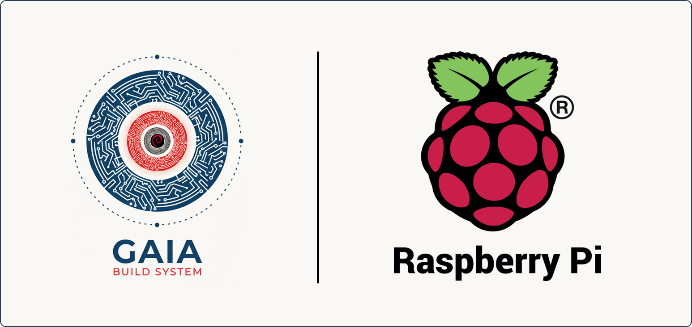

# Cookbook for Raspberry Pi Machines

<p align="center">
    
</p>

This cookbook provides a collection of recipes to help you get started with DeimOS for Raspberry Pi 4b/5b.

## Supported Boards -> Machines

| Board                      | Gaia Machine Name   |
|----------------------------|---------------------|
| Raspberry Pi 5B            | rpi5b               |
| Compute Module 5           | cm5                 |
| Raspberry Pi 4B            | rpi4b               |
| Compute Module 4           | cm4                 |

## Prerequisites

- [Gaia project Gaia Core](https://github.com/gaiaBuildSystem/gaia);

## Build an Image

```bash
./gaia/bitcook --buildPath /home/user/workdir --distro ./cookbook-rpi/distro-ref-rpi4b.json --noCache
```

This will build DeimOS for Raspberry Pi 4B.
